<a href="http://www.dev-forum.eu/" style="font-size: 48px;">Link to website</a>

Note: works best in 1920x1080 and above (not mobile responsive yet)

## Tech Stack:

- Django
- TailwindCSS
- Docker
- AWS

## Images

- Login Page
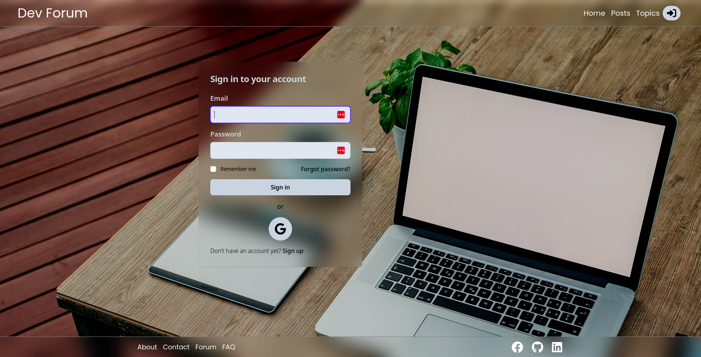
- Register Page
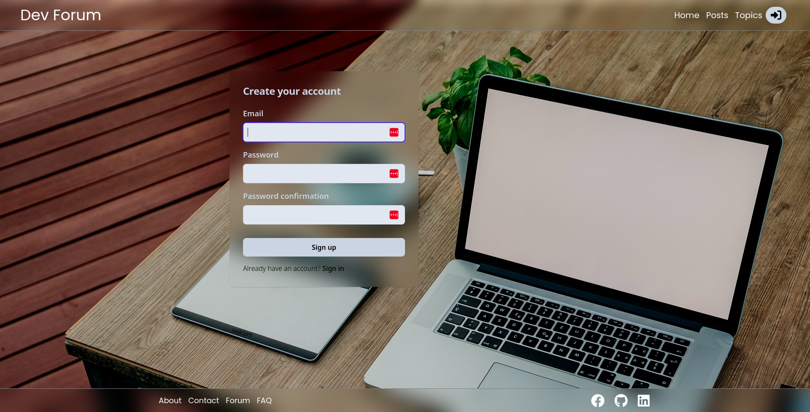
- Home Page
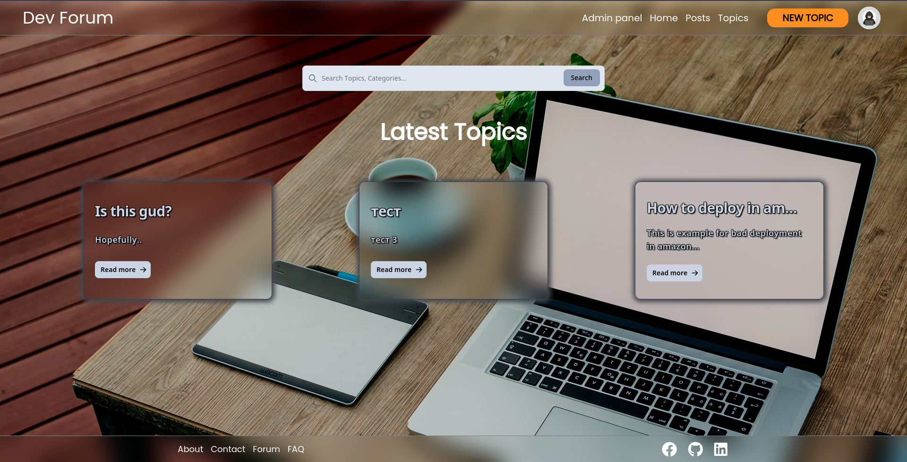
- Create Post Page
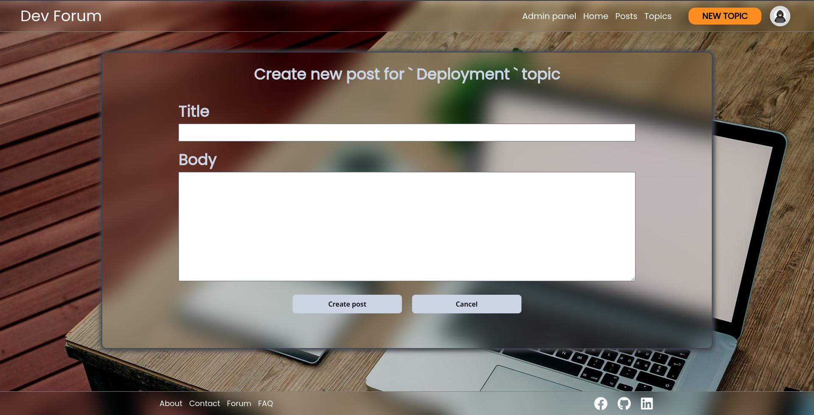
- All Posts Page
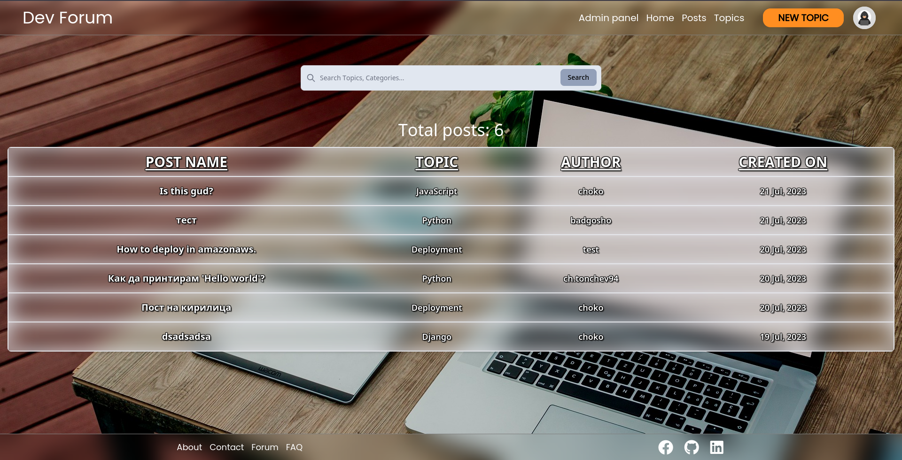
- Post Detail Page
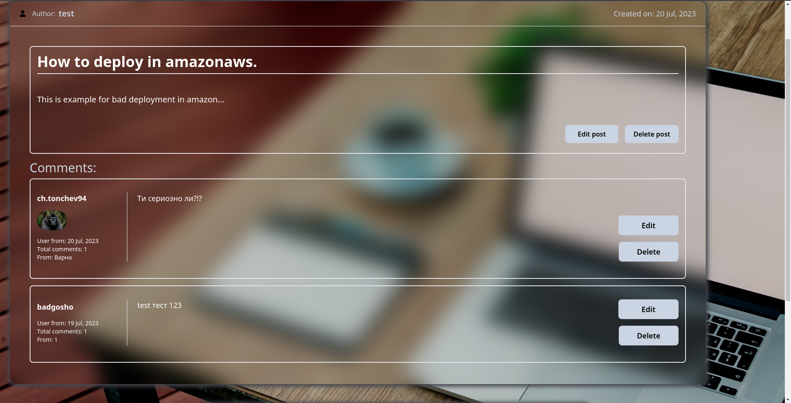
- Create Topic Page
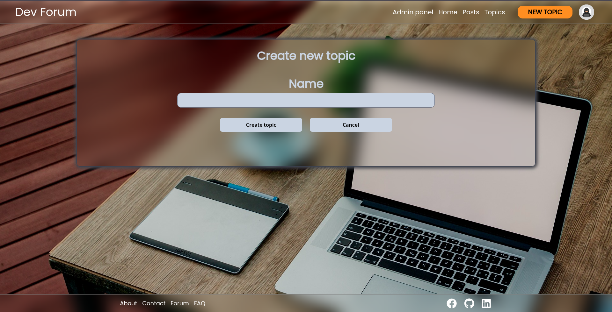
- All Topics Page
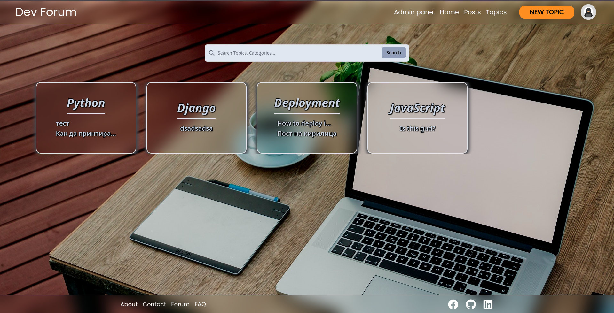
- Profile Page
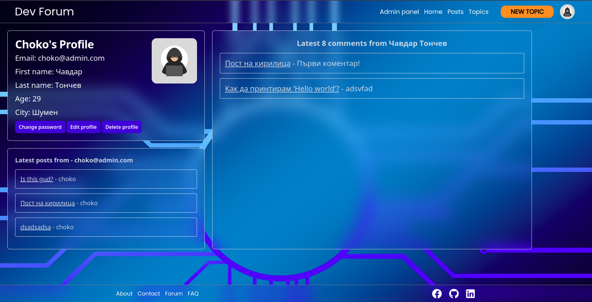
- Profile Edit Page
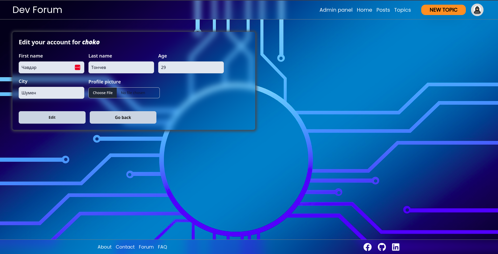
- Profile Password Change
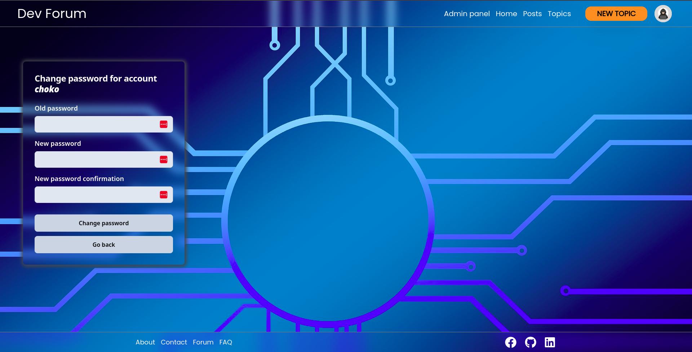
- Profile Delete Page
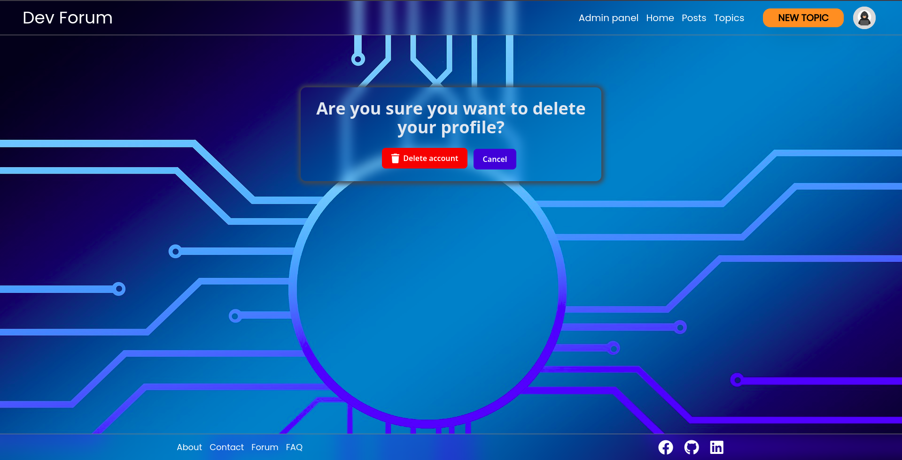
- Admin Page
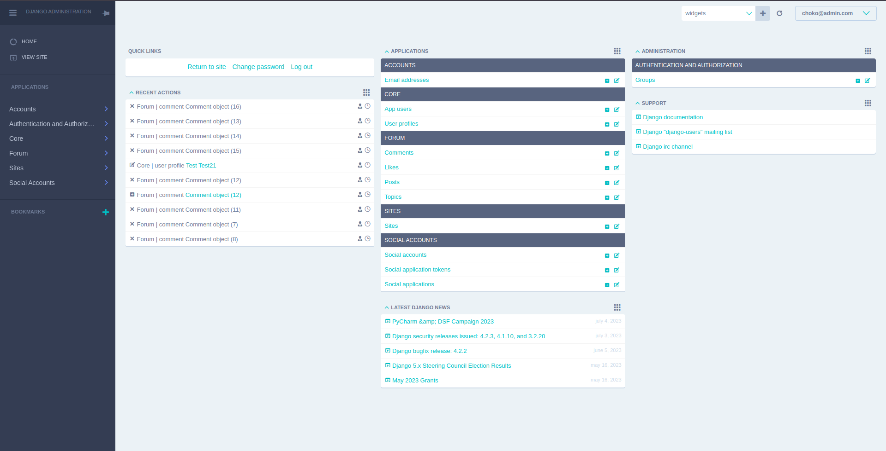
